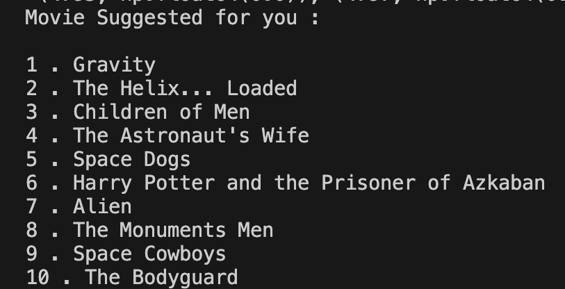

<!DOCTYPE html>
<html lang="en">
<body>
    <h1>Movie Recommendation System For ACM</h1>
    

        
     

    
This project aims to build a movie recommendation system using Machine Learning (ML) techniques. The system will analyze user data like ratings, watch history, and preferences to suggest personalized movie choices, helping users navigate the vast film catalog efficiently.

    <h3>Movie Recommended Systems:</h3>
    <ol>
        <li><strong>Content-Based Recommended System:</strong> This system recommends movies based on the similarity of their content (e.g., genre, actors, plot) to the user's past preferences. It analyzes the features of movies a user has liked and suggests similar ones.</li>
        <li><strong>Popularity-Based Recommended System:</strong> This system recommends movies based on their overall popularity among all users, typically measured by ratings, views, or sales. It suggests the most widely liked or trending movies at the moment.</li>
        <li><strong>Collaborative-Based Recommended System:</strong> This system recommends movies based on the preferences of users with similar tastes. It identifies users who have liked the same films and suggests movies that other like-minded users have enjoyed.</li>
    </ol>
    <h1>WORKFLOW</h1>
    <ul>
        <li>Data</li>
        <li>Data Preprocessing</li>
        <li>Feature Extractions</li>
        <li>User Input</li>
        <li>Cosine Similarity Algorithm</li>
        <li>List of Movies</li>
    </ul>
    <h2>Cosine Similarity Algorithm:</h2>
    
The cosine similarity algorithm is a method used in machine learning and information retrieval to measure the similarity between two non-zero vectors. It calculates the cosine of the angle between the vectors, which gives a value between -1 and 1, where 1 indicates that the vectors are identical, 0 means they are orthogonal (dissimilar), and -1 signifies that they are diametrically opposite.

    
The cosine similarity is particularly useful for determining the similarity between two documents or text data, where each document is represented as a vector of word frequencies or embeddings.

    
It is widely used in recommendation systems, text analysis, and clustering algorithms.

    <h1>Result</h1>
    

        
    

    

        
    

<!--     <h2>Video of Result</h2>
    <video width="600" controls>
        <source src="video.mp4" type="video/mp4">
    </video> -->
    <h2>Resources</h2>

Movie Dataset: <a href="https://drive.google.com/file/d/1cCkwiVv4mgfl20ntgY3n4yApcWqqZQe6/view" target="_blank">View Dataset</a>

Research Paper: <a href="https://www.riejournal.com/article_106395_c6c0038f1bf5d4c421bd552d0541d6bepdf" target="_blank">Read Paper</a>

</body>
</html>
